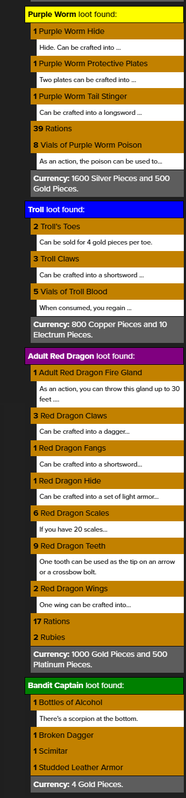

# generateLoot
 Roll20 api companion script for DMs to have randomly generated loot from NPCs.  Inspired from purchasing https://www.dmsguild.com/product/309506/Monster-Loot--Out-of-the-Abyss and knew that I was too lazy to look up in the pdf each time a monster died.  This was made for 5e and using pre-made NPCs found in the modules.



Commands:

`!generateLoot`

Can be used either by selecting all tokens and it counts total of each npc and displays loot appropriately.  Alternatively can be used as `!generateLoot x` where x is the number of the npc you have selected. 


The bulk of this is handled under the `generateLoot` function, where the NPC's name is in the switch statement and then an entry is made for each item.

```javascript
case "Bandit Captain":
    items = [
        {
            name: "Bottles of Alcohol",
            dice: "1d2",
            description: "There's a scorpion at the bottom."
        },
        {
            name: "Broken Dagger",
            dice: "1"
        },
        {
            name: "Broken Scimitar",
            dice: "1"
        },
        {
            name: "Broken Studded Leather Armor",
            dice: "1"
        }
    ];
```

`name` and `dice` are required fields.

    `name` is for that item.  It supports adding "Broken" to the start of the item, and when loot is output there is a 65% chance for it to be not-broken.

    `dice` being formatted as either a whole number "1" or dice notation "1d6", "1d10+5"

`description` is optional and provides further context to the player for that item

Additionally, will format the color of the header of npc based on npc_challenge.

Finally, this commands takes into account the npc_type, defined in `const exclusions` to not drop currency.  If it is not excluded then it will look at the npc_challenge and generate currency for the creature based on the individual loot table in the DMG.

---

`!analyzeLoot`

This is used to poll the token selected and show whether it is in the NPC database. If it exists, then displays each loot item with the dice used to determine quantity.


---

`!harvestCheck`

Determines what type of check is needed to roll (based on npc_type), DC (based on npc_challenge), and how long it will take (based on creature size, found in npc_type as well).


